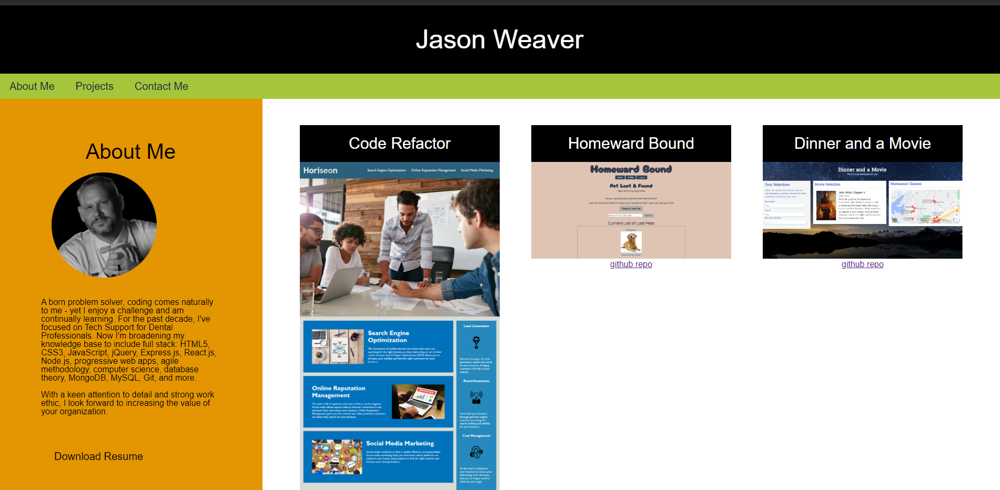

# Weaver-Web-Werx
  ## Technologies used
  

  ## Table of Contents
  *[license](#license)

  *[title](#title)

  *[usage](#usage)

  *[livelink](#livelink)

  *[screenshot](#screenshot)

  *[description](#description)

  *[installation](#installation)

  *[tests](#tests)

  *[contributing](#contributing)

  *[challenge](#challenge)

  *[github](#github)

  *[email](#email)

  ## License
  
  This project is licensed under the MIT license.
  https://opensource.org/licenses/MIT

  ## Title
  Weaver-Web-Werx

  ## Usage
My personal portfolio serves as a powerful tool for showcasing your coding skills, expertise, and accomplishments to potential employers. It allows you to present a curated selection of your best work, demonstrating your capabilities and the value you can bring to a company or project.
  

  ## LiveLink
  https://github.com/Jweaver74/Weaver-Web-Werx

  ## screenshot
   
  

  ## Description
  My personal coding portfolio showcases my passion for coding and the diverse range of projects I have developed. With a strong foundation in various programming languages and frameworks, my portfolio reflects my expertise in web development, mobile app creation, and software engineering. From responsive and visually appealing websites to innovative mobile applications, each project exemplifies my meticulous attention to detail, problem-solving skills, and dedication to delivering high-quality solutions. By exploring my portfolio, you will witness my ability to transform complex ideas into functional and user-friendly applications, demonstrating my commitment to creating impactful digital experiences.
  

  ## Installation
  Clone the Github repo and open the Index.js file in the live server.
  

  ## Tests
  

  ## Contributing
  [Contributor Covenant](https://www.contributor-covenant.org/)
  

  ## Challenge
  

  ## GitHub
  https://github.com/Jweaver74

  ## Email
  jamaweaver@yahoo.com

  ## Questions
  If you have any questions, please contact me at [Jason Weaver](Jamaweaver@yahoo.com) or visit my GitHub page at [Jweaver74](https://github.com/Jweaver74)

